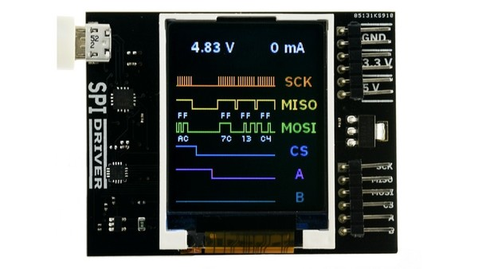

[](https://raw.githubusercontent.com/alandoherty/spidriver-net/master/LICENSE)
[](https://github.com/alandoherty/spidriver-net/issues)
[](https://github.com/alandoherty/spidriver-net/stargazers)
[](https://github.com/alandoherty/spidriver-net/network)
[](https://www.nuget.org/packages/SPIDriver/)

</div>

# spidriver

An unofficial .NET library for [SPIDriver](https://spidriver.com/), allows for synchronous/asynchronous control of the device via the serial port. Open permissive MIT license with a dual-compliation for .NET Standard 2.0 and .NET Framework 4.6.1.



## Getting Started

[](https://www.nuget.org/packages/SPIDriver/)

You can install the package using either the CLI:

```
dotnet add package SPIDriver
```

or from the NuGet package manager:

```
Install-Package SPIDriver
```

For assistance with the SPIDriver product itself you can view the [user guide](https://spidriver.com/spidriver.pdf) hosted on the official website.

### Example

You can find the example project `Example.CommandLine`, which demonstrates a CLI which implements all the features of the library.

```
> connect
Connected successfully
> status
Model: spidriver1
Serial Number: DO01JHMO
Uptime: 01:56:22
Voltage: 5.203V
Current: 0A
Temperature: 32.6°C
A: True
B: True
CS: True
CRC: 0x0001
> writef airline.mp4
Wrote 1510004 bytes in 33.294s
```

## Contributing

Any pull requests or bug reports are welcome, please try and keep to the existing style conventions and comment any additions.